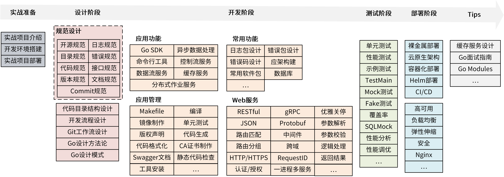
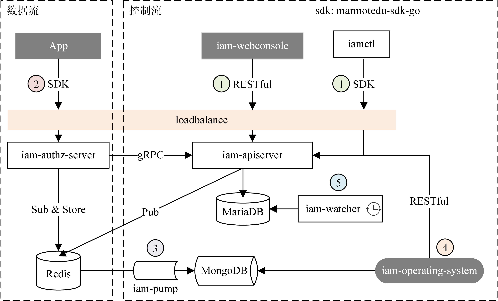

# IAM - 身份识别与访问管理系统

IAM = **I**dentity and **A**ccess **M**anagement

IAM 是一个基于 Go 语言开发的身份识别与访问管理系统，用于对资源访问进行授权。

IAM 同时也具有以下能力：

1. 作为一个开发脚手架，供开发者克隆后二次开发，快速构建自己的应用。


## 功能特性

本项目用到了Go企业开发的大部分核心技能点，见下图：



## 软件架构



架构解析见：[IAM 架构 & 能力说明](./docs/guide/zh-CN/installation/installation-architecture.md)

## 快速开始

### 依赖检查

1. 服务器能访问外网

2. 操作系统：CentOS Linux 8.x (64-bit)

> 本安装脚本基于 CentOS 8.2 安装，建议你选择 CentOS 8.x 系统。其它Linux发行版、macOS也能安装，不过需要手动安装。

### 快速部署

快速部署请参考：[IAM 部署指南](docs/guide/zh-CN/installation/README.md#快速部署)

> IAM 项目还提供了更详细的部署文档，请参考：[手把手教你部署IAM系统](docs/guide/zh-CN/installation/installation-procedures.md)

### 构建

如果你需要重新编译IAM项目，可以执行以下 2 步：

1. 克隆源码

```bash
$ git clone https://github.com/robinlg/iam $GOPATH/src/github.com/robinlg/iam
```

2. 编译

```bash
$ cd $GOPATH/src/github.com/robinlg/iam
$ make
```

构建后的二进制文件保存在 `_output/platforms/linux/amd64/` 目录下。

## 使用指南

[IAM Documentation](docs/guide/zh-CN)

## 如何贡献

欢迎贡献代码，贡献流程可以参考 [developer's documentation](docs/devel/zh-CN/development.md)。

## 社区

You are encouraged to communicate most things via [GitHub issues](https://github.com/robinlg/iam/issues/new/choose) or pull requests.

## 保持联系


## 许可证

IAM is licensed under the MIT. See [LICENSE](LICENSE) for the full license text.
